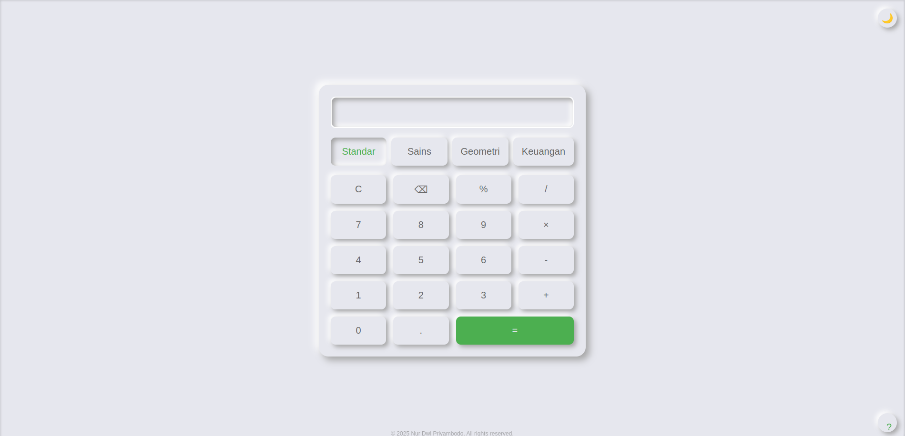
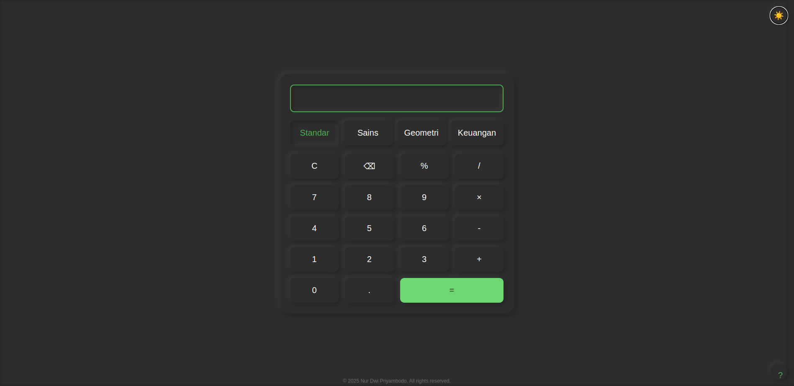

<div align="center">

# 🧮 Kalkulator Lengkap


Aplikasi kalkulator web modern dengan fitur lengkap dan desain neumorphic yang elegan.

[Lihat Demo](http://localhost:6009) | [Dokumentasi](#dokumentasi) | [Unduh](#unduh)



</div>

---

## ✨ Fitur Unggulan

<div align="center">

| 🔢 Standar    | 🔬 Sains       | 📐 Geometri  | 💰 Keuangan   |
| ------------- | -------------- | ------------ | ------------- |
| Operasi Dasar | Trigonometri   | Bangun Datar | Bunga Majemuk |
| Persentase    | Logaritma      | Bangun Ruang | Bunga Tunggal |
| Riwayat       | Faktorial      | Volume       | KPR           |
| Memory        | Pangkat & Akar | Luas         | Investasi     |

</div>

## 🎨 Desain Modern

- **Neumorphic UI** - Desain 3D yang modern dan elegan
- **Mode Gelap/Terang** - Mendukung preferensi pengguna
- **Responsif** - Tampilan optimal di semua perangkat
- **Animasi Halus** - Transisi dan efek yang menarik

## ⚡ Keunggulan

- 📱 **Multi-Platform**

  - Desktop & Mobile
  - Semua Browser Modern
  - PWA Support

- 🔐 **Handal & Aman**

  - Perhitungan Akurat
  - Validasi Input
  - Error Handling

- ⌨️ **Pintasan Keyboard**
  ```
  Enter = Hitung
  Esc   = Hapus
  ?     = Bantuan
  ```

## 🚀 Cara Menggunakan

### Menggunakan Docker

1. Clone repository:

```bash
git clone https://github.com/NDP4/kalkulator.git
```

2. Masuk ke direktori proyek:

```bash
cd kalkulator-lengkap
```

3. Jalankan dengan Docker Compose:

```bash
docker-compose up -d
```

4. Akses kalkulator di `http://localhost:6009`

### Instalasi Manual

1. Clone repository
2. Buka file `index.html` di browser

## Pintasan Keyboard

- Angka (0-9): Input angka
- Operator (+, -, \*, /): Operasi matematika
- Enter/=: Hitung hasil
- Esc: Hapus semua
- Backspace: Hapus karakter terakhir
- (): Tanda kurung
- Mode Sains:
  - S: Sin
  - C: Cos
  - T: Tan
  - L: Log
  - N: Ln
  - Q: Kuadrat (x²)
  - U: Kubik (x³)
  - R: Akar kuadrat (√)

## 💻 Teknologi

<div align="center">


</div>

## 📱 Screenshot

<div align="center">
| Mode Terang |	Mode Gelap |
| |	 |
</div>

## Dukungan Browser

- Chrome (direkomendasikan)
- Firefox
- Safari
- Edge

## Kontribusi

Silakan kirim issues dan pull request untuk pengembangan aplikasi.

## Lisensi

© 2025 Nur Dwi Priyambodo. Hak Cipta Dilindungi Undang-Undang.
